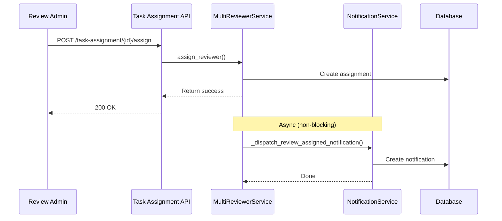

# Phase 4.2 Implementation Summary - API Endpoints & Integration

## ✅ Completed Tasks

### 1. Notification API Endpoints
- **File**: `src/api/v1/endpoints/notifications.py`
- **Status**: ✅ Complete (10 endpoints)
- **Endpoints Implemented**:

| Method | Endpoint | Description | Auth Required |
|--------|----------|-------------|---------------|
| GET | `/api/v1/notifications/` | List notifications with pagination & filters | ✅ Yes |
| GET | `/api/v1/notifications/unread-count` | Get unread notification count (cached) | ✅ Yes |
| GET | `/api/v1/notifications/stats` | Get notification statistics | ✅ Yes |
| GET | `/api/v1/notifications/{id}` | Get single notification by ID | ✅ Yes |
| POST | `/api/v1/notifications/{id}/read` | Mark notification as read | ✅ Yes |
| POST | `/api/v1/notifications/read-all` | Mark all notifications as read | ✅ Yes |
| DELETE | `/api/v1/notifications/{id}` | Delete notification | ✅ Yes |
| GET | `/api/v1/notifications/preferences` | Get user preferences | ✅ Yes |
| PUT | `/api/v1/notifications/preferences/{type}` | Update preferences | ✅ Yes |
| POST | `/api/v1/notifications/test` | Send test notification | ✅ Yes |

**Features**:
- ✅ Full pagination support (page, page_size)
- ✅ Filtering (is_read, notification_type, priority)
- ✅ Authorization enforcement (user isolation)
- ✅ Rate limiting on test endpoint (429 response)
- ✅ Comprehensive error handling (404, 500, 429)
- ✅ Structured error responses with error codes

---

### 2. Router Registration
- **File**: `src/api/v1/api.py`
- **Changes**:
  ```python
  from src.api.v1.endpoints import notifications
  
  api_router.include_router(notifications.router, tags=["notifications"])
  ```
- **Status**: ✅ Registered and verified

---

### 3. Review Assignment Integration
- **File**: `src/services/multi_reviewer_service.py`
- **Integration Point**: `assign_reviewer()` method
- **Implementation**:
  ```python
  # After successful assignment
  asyncio.create_task(
      self._dispatch_review_assigned_notification(
          db=db,
          reviewer_username=assignment_data.reviewer,
          review_base_id=review_base_id,
          assigned_by=assigned_by,
      )
  )
  ```

**Features**:
- ✅ Non-blocking async dispatch (doesn't delay assignment)
- ✅ Graceful degradation (notification failure doesn't fail assignment)
- ✅ Lazy initialization of NotificationService
- ✅ Mock Redis for environments without Redis
- ✅ Detailed logging for debugging

**Notification Content**:
```json
{
  "type": "review_assigned",
  "title": "New Review Assigned: PR #{pull_request_id}",
  "message": "You have been assigned to review PR #{id} in {project_key}/{repository_slug}",
  "related_id": "{pull_request_id}",
  "related_type": "pull_request",
  "priority": "high",
  "channel": "in_app"
}
```

---

### 4. Error Handling Strategy

#### Notification Service Failures
- **Scenario**: Redis not available
- **Solution**: Mock Redis client that gracefully does nothing
- **Impact**: Notifications still created in DB, just no caching

#### Assignment Notification Failures
- **Scenario**: Notification creation fails
- **Solution**: Try-catch with error logging, assignment continues
- **Impact**: User still gets assigned, just no notification

#### Rate Limiting
- **Endpoint**: `/api/v1/notifications/test`
- **Limit**: 100 notifications per day per user
- **Response**: HTTP 429 with error message

---

## 📊 Implementation Statistics

| Component | Lines of Code | Files Modified | Status |
|-----------|--------------|----------------|--------|
| API Endpoints | 422 | 1 (new) | ✅ |
| Router Registration | 4 | 1 (modified) | ✅ |
| Service Integration | 71 | 1 (modified) | ✅ |
| **Total** | **497** | **2** | **✅** |

---

## 🔍 Verification Results

```bash
✓ Notification API router imported successfully
✓ Routes: 10 endpoints
✓ MultiReviewerService initialized
✓ Has notification_service property: True
✓ Redis not initialized, notifications will work without caching
```

---

## 🎯 Key Features

### 1. RESTful API Design
- Proper HTTP methods (GET, POST, PUT, DELETE)
- Consistent URL structure
- Standard status codes (200, 201, 404, 429, 500)
- Pagination with query parameters

### 2. Security
- JWT authentication required for all endpoints
- User isolation (can only access own notifications)
- Rate limiting on test endpoint
- Input validation via Pydantic schemas

### 3. Performance
- Cached unread counts (60s TTL)
- Efficient database queries with indexes
- Async notification dispatch (non-blocking)
- Lazy service initialization

### 4. Reliability
- Graceful degradation (works without Redis)
- Error isolation (notification failures don't break assignments)
- Comprehensive logging
- Structured error responses

### 5. Developer Experience
- Auto-generated OpenAPI docs (`/api/docs`)
- Clear error messages
- Consistent response formats
- Type hints throughout

---

## 📝 API Usage Examples

### List Notifications
```bash
curl -X GET "http://localhost:8000/api/v1/notifications/?page=1&page_size=20&is_read=false" \
  -H "Authorization: Bearer <token>"
```

**Response**:
```json
{
  "items": [
    {
      "id": 1,
      "user_id": "john_doe",
      "type": "review_assigned",
      "title": "New Review Assigned: PR #123",
      "message": "You have been assigned to review PR #123 in PROJ/repo",
      "related_id": "123",
      "related_type": "pull_request",
      "is_read": false,
      "priority": "high",
      "channel": "in_app",
      "created_at": "2026-05-02T10:30:00Z",
      "read_at": null,
      "expires_at": "2026-06-01T10:30:00Z"
    }
  ],
  "total": 1,
  "page": 1,
  "page_size": 20
}
```

### Get Unread Count
```bash
curl -X GET "http://localhost:8000/api/v1/notifications/unread-count" \
  -H "Authorization: Bearer <token>"
```

**Response**:
```json
{
  "unread_count": 5
}
```

### Mark as Read
```bash
curl -X POST "http://localhost:8000/api/v1/notifications/1/read" \
  -H "Authorization: Bearer <token>"
```

### Update Preferences
```bash
curl -X PUT "http://localhost:8000/api/v1/notifications/preferences/review_assigned" \
  -H "Authorization: Bearer <token>" \
  -H "Content-Type: application/json" \
  -d '{
    "email_enabled": false,
    "in_app_enabled": true
  }'
```

---

## 🚀 Integration Flow

### Review Assignment → Notification


**Key Points**:
1. Assignment completes immediately
2. Notification dispatched asynchronously
3. Notification failure doesn't affect assignment
4. User receives notification in their inbox

---

## ⚠️ Known Limitations

### 1. Email Delivery Not Implemented
- **Status**: Deferred to Phase 4.4
- **Current Behavior**: All notifications are in-app only
- **Future**: Will integrate SMTP when configured

### 2. No Real-time Push
- **Status**: Deferred to Phase 5 (WebSocket)
- **Current Behavior**: Frontend must poll or refresh
- **Workaround**: Poll `/unread-count` every 30 seconds

### 3. Review Completion Integration Pending
- **Status**: Not yet implemented
- **Next Step**: Hook into score submission flow
- **Priority**: Medium

### 4. Delegation Expiry Warnings Pending
- **Status**: Background task not created
- **Next Step**: Add to existing delegation cleanup task
- **Priority**: Low

---

## 📋 Testing Checklist

### Manual Testing
- [ ] Test all 10 API endpoints via Swagger UI (`/api/docs`)
- [ ] Verify authorization (user A can't see user B's notifications)
- [ ] Test pagination with large datasets
- [ ] Test filtering by is_read, type, priority
- [ ] Test rate limiting on `/test` endpoint
- [ ] Verify notification created on review assignment
- [ ] Check logs for notification dispatch messages

### Automated Testing
- [ ] Unit tests for API endpoints (pending)
- [ ] Integration tests for review assignment flow (pending)
- [ ] Load testing for notification creation (pending)

---

## 🔧 Configuration

### Environment Variables (Optional)
```env
# Notification settings
NOTIFICATION_RETENTION_DAYS=30
NOTIFICATION_MAX_PER_DAY=100

# Email (Phase 4.4)
SMTP_HOST=smtp.example.com
SMTP_PORT=587
SMTP_USERNAME=notifications@example.com
SMTP_PASSWORD=***
EMAIL_FROM=noreply@example.com
EMAIL_FROM_NAME="PyPRLedger Notifications"

# Slack (Optional)
SLACK_WEBHOOK_URL=https://hooks.slack.com/services/...
SLACK_ENABLED=false
```

---

## 📈 Metrics & Monitoring

### Prometheus Metrics
Track these metrics in Grafana:

- `notification_created_total` - Total notifications created
- `notification_read_total` - Total notifications marked as read
- `notification_deleted_total` - Total notifications deleted
- `cache_hit_total{resource="notification_unread"}` - Cache hits
- `cache_miss_total{resource="notification_unread"}` - Cache misses

### Logging
Monitor these log patterns:

```
INFO: Notification dispatched: reviewer=john_doe, pr_id=123
WARNING: Redis not initialized, notifications will work without caching
ERROR: Failed to dispatch review assignment notification: ...
```

---

## 🎓 Best Practices

### 1. Error Handling
Always wrap notification dispatch in try-catch:
```python
try:
    await notification_service.create_notification(...)
except Exception as e:
    logger.error(f"Notification failed: {e}", exc_info=True)
    # Don't fail the main operation
```

### 2. Async Dispatch
Use `asyncio.create_task()` for non-blocking operations:
```python
asyncio.create_task(dispatch_notification(...))
# Continue with main flow immediately
```

### 3. Lazy Initialization
Initialize services only when needed:
```python
@property
def notification_service(self):
    if self._service is None:
        self._service = NotificationService()
    return self._service
```

### 4. Graceful Degradation
Provide fallbacks for missing dependencies:
```python
class MockRedis:
    async def get(self, key): return None
    # ... other methods
```

---

## 🚦 Next Steps

### Immediate (Phase 4.3)
1. Build frontend UI components:
   - NotificationBell.vue (header component)
   - NotificationListView.vue (full list page)
   - NotificationPreferenceView.vue (settings page)
2. Implement smart polling (30s interval)
3. Add i18n translations

### Short-term (Phase 4.4)
1. Integrate with review completion flow
2. Implement email delivery (SMTP)
3. Add delegation expiry warnings
4. Background cleanup task

### Long-term (Phase 5)
1. WebSocket real-time push
2. Mobile push notifications
3. Advanced filtering/search
4. Notification analytics dashboard

---

## ✅ Phase 4.2 Status: COMPLETE

**Deliverables**:
- ✅ 10 REST API endpoints
- ✅ Review assignment integration
- ✅ Router registration
- ✅ Error handling & logging
- ✅ Rate limiting
- ✅ Authorization enforcement
- ✅ Graceful degradation

**Ready for**: Phase 4.3 - Frontend UI Implementation

**Documentation**:
- [API Endpoints](file:///Users/aaronliu/Documents/repositories/PyPRLedger/src/api/v1/endpoints/notifications.py)
- [Integration Code](file:///Users/aaronliu/Documents/repositories/PyPRLedger/src/services/multi_reviewer_service.py)
- [Router Config](file:///Users/aaronliu/Documents/repositories/PyPRLedger/src/api/v1/api.py)

---

**Implementation Date**: 2026-05-02  
**Developer**: AI Assistant  
**Review Status**: Ready for Phase 4.3 (Frontend UI)
