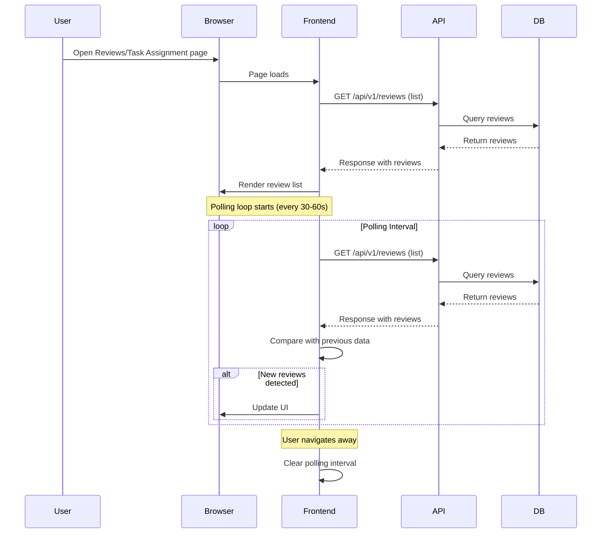
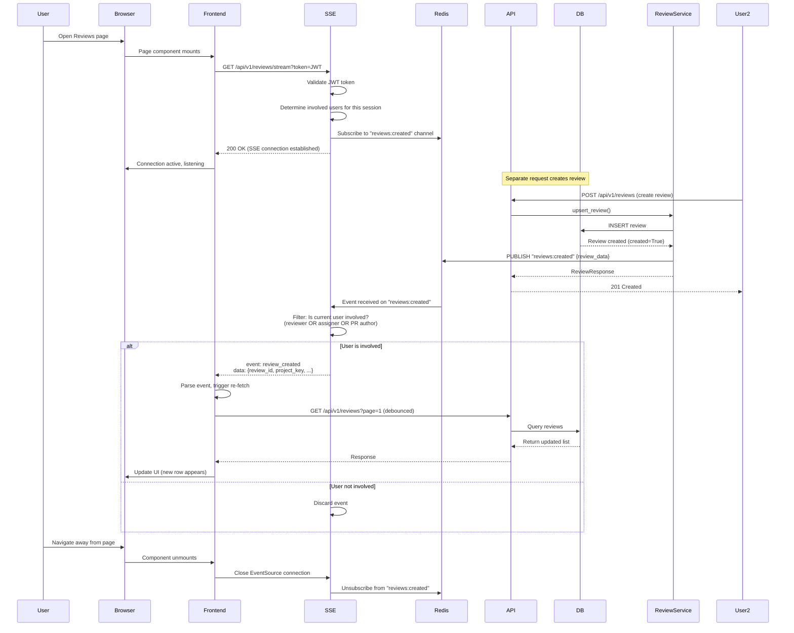

# Business Analysis: Server-Sent Events (SSE) for New PR Review Insertions

## 1. Requirements Summary

### 1.1 Feature Overview
Implement a real-time notification system using Server-Sent Events (SSE) to push new pull request review events to connected clients. When a new review is created in the system, subscribed users who are involved in that review (as reviewer, assigner, or PR author) will receive an immediate notification via SSE, prompting them to refresh their data.

### 1.2 Primary Goal
Reduce latency between review creation and user awareness from polling-based refresh (typically 30-60 seconds) to sub-second real-time delivery, improving the review workflow experience for developers and reviewers.

### 1.3 Key Requirements

| Requirement | Detail |
|-------------|--------|
| **Endpoint** | `GET /api/v1/reviews/stream?token=<JWT>` |
| **Auth Mechanism** | JWT passed as query parameter (not header) |
| **Event Trigger** | Only on review creation (`created=True` in `upsert_review()`) |
| **User Filtering** | Events only for users involved in the review |
| **Involvement Criteria** | Reviewer, assigner, or PR author |
| **Payload** | Minimal: `{ review_id, project_key, repository_slug, pull_request_id, created_date }` |
| **Pages** | Reviews page and Task Assignment page auto-connect/disconnect |
| **Out of Scope** | Updates, deletions, status changes; full payload over SSE; WebSocket; offline/replay; cookie auth |

### 1.4 Success Criteria
- User sees new review within 1 second of creation
- Connection established in under 500ms
- Automatic reconnection with exponential backoff
- No duplicate events delivered
- Clean disconnect on page navigation
- Token expiry handled gracefully with re-authentication

---

## 2. Stakeholder Map

### 2.1 Primary Users (Direct Benefit)

| Stakeholder | Role | Benefit |
|-------------|------|---------|
| **Reviewers** | Users assigned to review PRs | Immediate notification when assigned to new review |
| **PR Authors** | Developers who submitted PRs | Real-time visibility when reviewer is assigned |
| **Review Admins** | Users with `assign` permission on reviews | Monitor review assignments across the team |
| **Task Assignment Users** | Users managing review assignments | Live updates on task distribution |

### 2.2 Secondary Users (Indirect Benefit)

| Stakeholder | Role | Benefit |
|-------------|------|---------|
| **Team Leads** | Managers reviewing team activity | Improved team velocity visibility |
| **Project Managers** | Tracking review cycle times | Faster issue detection |
| **System Administrators** | Platform maintainers | Reduced polling load on backend |

### 2.3 Non-Human Stakeholders

| Stakeholder | Interest |
|-------------|----------|
| **Frontend App** | Real-time data synchronization |
| **Backend API** | Efficient event distribution |
| **Redis** | Pub/sub message broker |
| **Database** | Source of truth for review data |
| **Monitoring Systems** | Connection health metrics |

---

## 3. Current State Process Flow

### 3.1 "Before" State: Polling-Based Discovery



### 3.2 Current State Pain Points

| Pain Point | Impact |
|------------|--------|
| **Latency** | 30-60 second delay between review creation and user notification |
| **Wasteful** | Repeated full list queries even when no new data exists |
| **Scalability** | N users × polling interval = constant DB load |
| **UX Impact** | Users manually refresh or switch away from page to check for updates |
| **Resource Usage** | Unnecessary network and server resources |

---

## 4. Future State Process Flow

### 4.1 "After" State: SSE Real-Time Updates



### 4.2 Event Publishing Logic

The event is published **only** when `upsert_review()` returns `created=True` (new review created, not updated). This happens in the `create_review()` method path (lines 348-445 in `review_service.py`) and in the `upsert_review()` method when a new review is created (line 585).

**Key location in `ReviewService.upsert_review()`:**
```python
# After successful creation
return new_review_response, True  # True = created
```

The SSE event should be published **after** the DB commit succeeds and the response is built, ensuring no phantom events for failed creations.

---

## 5. Data Flow Diagram

### 5.1 End-to-End Data Flow

```mermaid
flowchart TD
    A[Review Created<br/>(Bitbucket Webhook / API)] --> B[POST /api/v1/reviews]
    B --> C[ReviewService.upsert_review]
    C --> D{Review Exists?}
    D -->|No| E[Create New Review]
    D -->|Yes| F[Update Existing Review]
    E --> G[DB INSERT<br/>PullRequestReviewBase]
    E --> H[DB INSERT<br/>PullRequestReviewAssignment]
    G --> I[DB COMMIT]
    H --> I
    I --> J[Serialize Review Data]
    J --> K[Redis Cache Set<br/>review:{key}]
    I --> L[Redis PUBLISH<br/>channel: reviews:created]
    L --> M[SSE Endpoint<br/>/api/v1/reviews/stream]
    M --> N{User Involved?}
    N -->|Yes| O[SSE Event Sent<br/>event: review_created]
    N -->|No| P[Event Discarded]
    O --> Q[Frontend EventSource<br/>receives event]
    Q --> R[Frontend Re-fetches<br/>GET /api/v1/reviews]
    R --> S[DB Query]
    S --> T[Cache Check]
    T --> U[Response]
    U --> V[UI Updates]
    
    F --> W[DB UPDATE]
    W --> X[DB COMMIT]
    X --> Y[Cache Invalidation]
    Y --> Z[No SSE Event<br/>(updated=False)]
```

### 5.2 Component Interaction Map

```mermaid
flowchart LR
    subgraph "Backend"
        A[API Layer<br/>reviews.py] --> B[ReviewService<br/>upsert_review()]
        B --> C[(Database<br/>MySQL)]
        B --> D[(Redis<br/>Cache + Pub/Sub)]
        D --> E[SSE Endpoint<br/>GET /stream]
        E --> F[AuthService<br/>get_current_user()]
        E --> G[Involvement Filter]
    end
    
    subgraph "Frontend"
        H[SSEService<br/>frontend/utils/sse.ts] --> I[EventSource API]
        I -->|token query param| E
        H --> J[Reviews Page<br/>ReviewListView.vue]
        H --> K[Task Assignment Page<br/>TaskAssignmentView.vue]
        J --> L[API Re-fetch<br/>reviewsApi.getReviews()]
        K --> L
    end
    
    subgraph "Data Flow"
        M[New Review Created] --> D
        D -->|pub/sub| E
        E -->|filtered event| H
        L -->|refresh data| A
    end
```

---

## 6. Event Payload Specification

### 6.1 Redis Pub/Sub Message

Published by `ReviewService` after successful review creation.

```typescript
interface RedisReviewEvent {
  event: "review_created";
  timestamp: string;        // ISO 8601 UTC timestamp
  review_id: number;        // Internal DB ID of PullRequestReviewBase
  project_key: string;      // e.g., "ECOM"
  repository_slug: string;  // e.g., "frontend-store"
  pull_request_id: string;  // e.g., "1234"
  pull_request_user: string; // PR author username
  pull_request_status: string; // "open" | "merged" | "closed" | "draft"
  reviewer?: string | null;   // Assigned reviewer username (if any)
  source_filename?: string | null; // null for PR-level review
  created_date: string;     // ISO 8601 with timezone offset (local time)
}
```

**Example:**
```json
{
  "event": "review_created",
  "timestamp": "2026-05-20T14:32:15.123456+08:00",
  "review_id": 12345,
  "project_key": "ECOM",
  "repository_slug": "frontend-store",
  "pull_request_id": "5678",
  "pull_request_user": "alice",
  "pull_request_status": "open",
  "reviewer": "bob",
  "source_filename": null,
  "created_date": "2026-05-20T14:32:10.000000+08:00"
}
```

### 6.2 SSE Event Payload

Sent from backend SSE endpoint to frontend. Contains the **minimal** fields as specified.

```typescript
interface SSEReviewEvent {
  event: "review_created";
  data: {
    review_id: number;
    project_key: string;
    repository_slug: string;
    pull_request_id: string;
    created_date: string;  // ISO 8601 with timezone
  };
}
```

**SSE Format:**
```
event: review_created
data: {"review_id":12345,"project_key":"ECOM","repository_slug":"frontend-store","pull_request_id":"5678","created_date":"2026-05-20T14:32:10.000000+08:00"}

```

**Note on Timezone:** The `created_date` is stored in the database with timezone info (UTC or configured timezone per `USE_UTC_IN_DB` setting). The `utc_to_local()` function in the model `to_dict()` converts it to the configured application timezone before serialization. The SSE payload will include the timezone offset in the ISO string.

### 6.3 Redis Channel Naming

```python
# Channel pattern
"reviews:created"  # Single channel for all review creations
# Future: "reviews:created:{project_key}" for per-project channels
```

### 6.4 Payload Field Reference

| Field | Type | Source | Notes |
|-------|------|--------|-------|
| `event` | string | Hardcoded `"review_created"` | Identifies event type |
| `review_id` | integer | `PullRequestReviewBase.id` | Internal DB surrogate key |
| `project_key` | string | `PullRequestReviewBase.project_key` | Business key |
| `repository_slug` | string | `PullRequestReviewBase.repository_slug` | Business key |
| `pull_request_id` | string | `PullRequestReviewBase.pull_request_id` | Business key |
| `created_date` | string | `PullRequestReviewBase.created_date` | ISO 8601 with timezone |
| `pull_request_user` | string | `PullRequestReviewBase.pull_request_user` | PR author |
| `pull_request_status` | string | `PullRequestReviewBase.pull_request_status` | PR status |
| `reviewer` | string \| null | `PullRequestReviewAssignment.reviewer` | If assignment exists |

---

## 7. Filtering Logic Specification

### 7.1 User Involvement Definition

A user is considered **"involved"** in a review if ANY of the following conditions are true:

| Involvement Type | Check Field | Database Column |
|-----------------|-------------|-----------------|
| **Reviewer** | `reviewer` username matches | `PullRequestReviewAssignment.reviewer` |
| **Assigner** | `assigned_by` username matches | `PullRequestReviewAssignment.assigned_by` |
| **PR Author** | `pull_request_user` username matches | `PullRequestReviewBase.pull_request_user` |

### 7.2 Filtering Algorithm

```python
async def is_user_involved_in_review(
    review: dict,
    username: str,
) -> bool:
    """
    Determine if a user is involved in a review.
    
    Args:
        review: The review event payload (from Redis)
        username: The authenticated user's Bitbucket username
        
    Returns:
        True if user is involved, False otherwise
    """
    # 1. Check if user is the PR author
    if review["pull_request_user"] == username:
        return True
    
    # 2. Check if user is the assigned reviewer
    if review.get("reviewer") == username:
        return True
    
    # 3. Check if user assigned the review (assigned_by)
    # Note: This requires the review event to include assigned_by
    # If not included in minimal payload, we need to fetch from DB
    if review.get("assigned_by") == username:
        return True
    
    return False
```

### 7.3 Edge Cases in Filtering

#### 7.3.1 User is Both Reviewer and PR Author
- **Scenario:** Alice creates a PR and is also assigned as reviewer.
- **Behavior:** Event is delivered (true from first condition, short-circuits).
- **UI Effect:** Alice sees the review in her list, which is correct.

#### 7.3.2 Soft-Deleted Assignments
- **Scenario:** A review assignment was soft-deleted after the event was published.
- **Behavior:** The event has already been published with the assignment data as it existed at creation time. The SSE endpoint cannot retroactively filter based on current DB state.
- **Mitigation:** The frontend re-fetches the list, and the current DB state is reflected in the response. The user may briefly see a notification for a review they no longer see in their list.

#### 7.3.3 Draft PRs
- **Specification:** No special filtering based on PR status.
- **Behavior:** Draft PRs generate SSE events like any other status.
- **Rationale:** The frontend already handles `pull_request_status: "draft"` in the review list.

#### 7.3.4 Multi-Reviewer Reviews
- **Scenario:** Multiple reviewers assigned to the same review base.
- **Behavior:** Each reviewer who is assigned will receive the event when the review is created. The `reviewer` field in the minimal payload reflects only the **first** reviewer if using `_serialize_review()` with an assignment.
- **Mitigation:** For SSE purposes, we should publish the review event once, and each involved user's SSE connection checks their own involvement. The minimal payload doesn't need to list all reviewers.

#### 7.3.5 Assigner Not in Assignment Record
- **Scenario:** A review is auto-created by the system (not manually assigned). `assigned_by` is `NULL`.
- **Behavior:** No assigner notification for auto-created reviews.
- **Rationale:** Only explicit assignments have an assigner.

#### 7.3.6 Deleted Users
- **Scenario:** The PR author or reviewer account is deleted after review creation.
- **Behavior:** The event will still contain the username string. The SSE filter will compare the string to the current user's username. If the current user's account exists but the referenced user doesn't, no matching occurs.
- **Mitigation:** The review should still be visible to the current user if their username matches, even if the other party's account is gone.

### 7.4 Filtering Implementation Location

The filtering should happen in the SSE endpoint handler, not in the Redis subscription layer. This allows:

1. **Single subscription:** One Redis subscriber per SSE connection, not per user.
2. **Dynamic filtering:** User context is available at request time (JWT decoded).
3. **Simpler architecture:** No need for per-user Redis channels.

```python
# Pseudo-code for SSE endpoint
async def sse_endpoint(request: Request, token: str):
    # 1. Validate token, get AuthUser
    auth_user = await auth_service.get_current_user(token)
    git_username = await get_git_username(auth_user.id, db)
    
    if not git_username:
        raise HTTPException(403, "No linked Bitbucket account")
    
    # 2. Subscribe to Redis pub/sub
    pubsub = redis_client.pubsub()
    await pubsub.subscribe("reviews:created")
    
    # 3. Stream events, filtering by involvement
    try:
        async for message in pubsub.listen():
            if message["type"] != "message":
                continue
            review = json.loads(message["data"])
            if await is_user_involved(review, git_username, db):
                yield f"event: review_created\ndata: {json.dumps(minimal_payload)}\n\n"
    finally:
        await pubsub.unsubscribe("reviews:created")
```

---

## 8. Frontend Integration Specification

### 8.1 SSEService Class (`frontend/src/utils/sse.ts`)

```typescript
/**
 * SSE Service for real-time review notifications
 * 
 * Features:
 * - JWT authentication via query parameter
 * - Automatic reconnection with exponential backoff
 * - Connection lifecycle management
 * - Event debouncing for re-fetch
 */

export interface SSEEvent {
  event: 'review_created';
  data: {
    review_id: number;
    project_key: string;
    repository_slug: string;
    pull_request_id: string;
    created_date: string;
  };
}

export interface SSEOptions {
  /** Maximum reconnection attempts before giving up */
  maxReconnectAttempts: number;
  /** Initial reconnection delay in ms */
  reconnectDelay: number;
  /** Maximum reconnection delay in ms */
  maxReconnectDelay: number;
  /** Debounce delay for re-fetch in ms */
  refetchDebounceMs: number;
}

export class SSEService {
  private eventSource: EventSource | null = null;
  private reconnectAttempts = 0;
  private reconnectTimeout: number | null = null;
  private refetchTimeout: number | null = null;
  private options: SSEOptions;
  private isManualDisconnect = false;
  
  constructor(options: Partial<SSEOptions> = {}) {
    this.options = {
      maxReconnectAttempts: 5,
      reconnectDelay: 1000,
      maxReconnectDelay: 30000,
      refetchDebounceMs: 500,
      ...options
    };
  }
  
  /**
   * Connect to SSE stream
   * @param token - JWT access token from auth store
   * @param onEvent - Callback when event received
   * @param onError - Callback for connection errors
   * @param onOpen - Callback when connection established
   */
  connect(
    token: string,
    onEvent: (event: SSEEvent) => void,
    onError?: (error: Event | Error) => void,
    onOpen?: () => void
  ): void {
    if (this.eventSource?.readyState === EventSource.OPEN) {
      console.warn('SSE already connected');
      return;
    }
    
    const url = `/api/v1/reviews/stream?token=${encodeURIComponent(token)}`;
    this.eventSource = new EventSource(url);
    this.isManualDisconnect = false;
    
    this.eventSource.addEventListener('open', () => {
      console.log('SSE connection opened');
      this.reconnectAttempts = 0;
      onOpen?.();
    });
    
    this.eventSource.addEventListener('review_created', (event: MessageEvent) => {
      try {
        const data: SSEEvent = JSON.parse(event.data);
        // Debounce the re-fetch to avoid multiple rapid calls
        this.debouncedRefetch(onEvent, data);
      } catch (e) {
        console.error('Failed to parse SSE event:', e, event.data);
      }
    });
    
    this.eventSource.addEventListener('error', (event: Event) => {
      console.error('SSE connection error:', event);
      
      if (this.isManualDisconnect) {
        return; // Don't reconnect on manual disconnect
      }
      
      onError?.(event);
      
      if (this.eventSource?.readyState === EventSource.CLOSED) {
        this.attemptReconnect(token, onEvent, onError, onOpen);
      }
    });
    
    this.eventSource.onerror = (event) => {
      // Native error handler for network failures
      if (this.eventSource?.readyState === EventSource.CLOSED) {
        this.attemptReconnect(token, onEvent, onError, onOpen);
      }
    };
  }
  
  /**
   * Disconnect from SSE stream
   */
  disconnect(): void {
    this.isManualDisconnect = true;
    
    if (this.reconnectTimeout) {
      clearTimeout(this.reconnectTimeout);
      this.reconnectTimeout = null;
    }
    
    if (this.refetchTimeout) {
      clearTimeout(this.refetchTimeout);
      this.refetchTimeout = null;
    }
    
    if (this.eventSource) {
      this.eventSource.close();
      this.eventSource = null;
      console.log('SSE disconnected');
    }
  }
  
  /**
   * Check if currently connected
   */
  isConnected(): boolean {
    return this.eventSource?.readyState === EventSource.OPEN;
  }
  
  /**
   * Attempt reconnection with exponential backoff
   */
  private attemptReconnect(
    token: string,
    onEvent: (event: SSEEvent) => void,
    onError?: (error: Event | Error) => void,
    onOpen?: () => void
  ): void {
    if (this.reconnectAttempts >= this.options.maxReconnectAttempts) {
      console.error('SSE max reconnection attempts reached');
      onError?.(new Error('Connection failed after maximum attempts'));
      return;
    }
    
    this.reconnectAttempts++;
    const delay = Math.min(
      this.options.reconnectDelay * Math.pow(2, this.reconnectAttempts - 1),
      this.options.maxReconnectDelay
    );
    
    console.log(`SSE reconnecting in ${delay}ms (attempt ${this.reconnectAttempts})`);
    
    this.reconnectTimeout = window.setTimeout(() => {
      this.connect(token, onEvent, onError, onOpen);
    }, delay);
  }
  
  /**
   * Debounced re-fetch to prevent multiple rapid calls
   */
  private debouncedRefetch(
    onEvent: (event: SSEEvent) => void,
    event: SSEEvent
  ): void {
    if (this.refetchTimeout) {
      clearTimeout(this.refetchTimeout);
    }
    
    this.refetchTimeout = window.setTimeout(() => {
      onEvent(event);
      this.refetchTimeout = null;
    }, this.options.refetchDebounceMs);
  }
}
```

### 8.2 Integration with Auth Store

```typescript
// In auth.ts store
import { sseService } from '@/utils/sse'

// Add to store state
const sseConnected = ref(false)

// Add to store actions
function connectSSE(token: string, onEvent: (event: SSEEvent) => void) {
  sseService.connect(
    token,
    onEvent,
    (error) => {
      console.error('SSE error:', error)
      // Show toast notification to user
      ElNotification({
        title: 'Connection Lost',
        message: 'Real-time updates disconnected. Retrying...',
        type: 'warning',
        duration: 3000
      })
    },
    () => {
      sseConnected.value = true
      ElNotification({
        title: 'Connected',
        message: 'Real-time updates enabled',
        type: 'success',
        duration: 2000
      })
    }
  )
}

function disconnectSSE() {
  sseService.disconnect()
  sseConnected.value = false
}
```

### 8.3 Integration with Reviews Page

```typescript
// In ReviewListView.vue or composable
import { onUnmounted, watch } from 'vue'
import { useAuthStore } from '@/stores/auth'
import { reviewsApi } from '@/api/reviews'
import { sseService } from '@/utils/sse'

export function useReviewSSE() {
  const authStore = useAuthStore()
  const isLoading = ref(false)
  
  // Connect when page becomes visible
  function startListening() {
    if (!authStore.accessToken || sseService.isConnected()) {
      return
    }
    
    authStore.connectSSE(authStore.accessToken, async (event) => {
      console.log('New review event:', event)
      
      // Re-fetch the reviews list
      isLoading.value = true
      try {
        await reviewsApi.getReviews({ page: 1, page_size: 20 })
        // The component will reactively update from the fetched data
      } catch (e) {
        console.error('Failed to re-fetch reviews:', e)
      } finally {
        isLoading.value = false
      }
    })
  }
  
  // Disconnect when page is hidden
  function stopListening() {
    authStore.disconnectSSE()
  }
  
  // Auto-connect on mount, disconnect on unmount
  onMounted(() => {
    startListening()
  })
  
  onUnmounted(() => {
    stopListening()
  })
  
  // Also stop when page visibility changes
  document.addEventListener('visibilitychange', () => {
    if (document.hidden) {
      stopListening()
    } else {
      startListening()
    }
  })
  
  return { startListening, stopListening }
}
```

### 8.4 Integration with Task Assignment Page

Same pattern as Reviews page. The task assignment page should also listen for `review_created` events and re-fetch its data when a new review matching the current user's assignments is created.

```typescript
// In TaskAssignmentView.vue or composable
import { taskAssignmentApi } from '@/api/taskAssignment'

// Re-fetch logic for task assignment
async function refetchTasks() {
  const response = await taskAssignmentApi.getReviews({ page: 1, page_size: 20 })
  // Update local state with response.items
}
```

---

## 9. Error Handling & Edge Cases

### 9.1 Redis Pub/Sub Failure

| Scenario | Impact | Handling |
|----------|--------|----------|
| Redis unavailable at review creation | SSE event lost for all users | Review is still persisted to DB. Users will eventually see it via polling or page refresh. Log error, increment metric `sse.publish_failed`. |
| Redis connection drops during SSE | SSE stream breaks, client sees `error` event | Frontend reconnects with exponential backoff. Missing events during gap are acceptable (at-most-once delivery). |
| Redis pub/sub channel full | Event publish fails or blocks | Redis pub/sub is fire-and-forget. Implement circuit breaker if failure rate exceeds threshold. |

### 9.2 SSE Connection Drop

| Scenario | Impact | Handling |
|----------|--------|----------|
| Network blip | Brief disconnection | Exponential backoff reconnection (1s, 2s, 4s, 8s, 16s up to 30s max). |
| Server restart | All connections lost | Frontend reconnects on next heartbeat or when page becomes visible. |
| Load balancer timeout | Connection closed by LB | Increase LB timeout to > 60s. Frontend reconnects. |
| Client goes to background (mobile) | Connection may be suspended | Browser manages this; EventSource resumes when tab becomes active. |

### 9.3 Token Expiry Mid-Connection

| Scenario | Impact | Handling |
|----------|--------|----------|
| JWT expires while SSE connected | SSE endpoint rejects next heartbeat/poll | EventSource will fire `error` event with 401. Frontend detects this and triggers logout flow, prompting user to re-authenticate. |
| Token refreshed in another tab | SSE still using old token | Old connection continues with old token until expiry. New tab creates new connection with fresh token. |

**Frontend Token Expiry Detection:**
```typescript
this.eventSource.addEventListener('error', (event) => {
  // Check if this is an auth error (would need SSE endpoint to return appropriate HTTP status)
  // Since SSE doesn't expose HTTP status directly, we rely on connection close
  // and check token expiry via a lightweight API call or decode JWT client-side
  if (this.isTokenExpired(authStore.accessToken)) {
    authStore.logout()
    router.push('/login')
  }
})
```

### 9.4 User Involvement Changes After Subscription

| Scenario | Impact | Handling |
|----------|--------|----------|
| User assigned to review after creation | No SSE event (only fires on creation) | User discovers via next page load or manual refresh. This is **by design** (scope limitation). |
| User unassigned from review before seeing event | Event already delivered | User may see notification for review they no longer see in list. Acceptable UX trade-off. |
| User role changes (reviewer → admin) | No effect on existing SSE filter | New connection will use updated role to determine involvement. |

### 9.5 Concurrent SSE Connections (Multiple Tabs)

| Scenario | Impact | Handling |
|----------|--------|----------|
| User opens Reviews page in 3 tabs | 3 SSE connections per user | Each tab independently subscribes. Redis pub/sub delivers event to all 3 connections. Frontend receives 3 events, but debounced re-fetch prevents 3 API calls. |
| User opens Reviews + Task Assignment pages | 2 SSE connections | Same as above. Both connections receive and filter events independently. |
| User logs out in one tab | Other tabs' connections become invalid | Each tab should handle 401 errors and disconnect/logout independently. |

### 9.6 Review Update vs. Creation

| Scenario | Behavior |
|----------|----------|
| `upsert_review()` with new review | `created=True` → SSE event published |
| `upsert_review()` with existing review | `created=False` → **No SSE event** |
| `update_review()` (PUT) | No SSE event (out of scope) |
| `update_review_status()` (PATCH) | No SSE event (out of scope) |
| `delete_review()` | No SSE event (out of scope) |

### 9.7 Network Partitions and Split-Brain

| Scenario | Impact | Handling |
|----------|--------|----------|
| User's network isolated from Redis | SSE connection fails | Exponential backoff reconnect. If network restores, connection resumes. |
| Redis partitioned, events published to minority partition | Some SSE consumers miss events | Redis pub/sub is not durable. Events lost. Users eventually see data via page refresh. |

---

## 10. Metrics & Observability

### 10.1 Metrics to Collect

Add these metrics to `src/utils/metrics.py`:

```python
# SSE Metrics
class SSEMetrics:
    # Gauge: Active SSE connections
    sse_connections_active = Gauge(
        "sse_connections_active",
        "Number of active SSE connections",
        ["user_id"],  # Optional: per-user label
    )
    
    # Counter: SSE connection attempts
    sse_connections_total = Counter(
        "sse_connections_total",
        "Total SSE connection attempts",
        ["status"],  # "connected", "rejected", "failed"
    )
    
    # Counter: SSE events published
    sse_events_published_total = Counter(
        "sse_events_published_total",
        "Total SSE events published to Redis",
        ["project_key", "status"],  # "success", "failed"
    )
    
    # Counter: SSE events delivered to clients
    sse_events_delivered_total = Counter(
        "sse_events_delivered_total",
        "Total SSE events delivered to clients",
        ["user_involved"],  # "true", "false"
    )
    
    # Histogram: SSE connection duration
    sse_connection_duration_seconds = Histogram(
        "sse_connection_duration_seconds",
        "Duration of SSE connections in seconds",
        buckets=[60, 300, 600, 1800, 3600, 7200],
    )
    
    # Counter: SSE reconnection attempts
    sse_reconnect_attempts_total = Counter(
        "sse_reconnect_attempts_total",
        "Total SSE reconnection attempts",
        ["attempt"],
    )
```

### 10.2 Log Events

```python
# Connection lifecycle
logger.info("SSE connection established", extra={
    "user_id": auth_user.id,
    "username": git_username,
    "session_id": session_id,
})

logger.info("SSE connection closed", extra={
    "user_id": auth_user.id,
    "username": git_username,
    "duration_seconds": duration,
    "reason": reason,  # "client_disconnect", "token_expired", "error"
})

# Event publishing
logger.info("SSE event published", extra={
    "review_id": review.id,
    "project_key": review.project_key,
    "channel": "reviews:created",
})

# Event filtering
logger.debug("SSE event filtered", extra={
    "review_id": review.id,
    "username": git_username,
    "involved": is_involved,
})

# Error conditions
logger.warning("SSE publish failed", extra={
    "review_id": review.id,
    "error": str(e),
})
```

### 10.3 Tracing

Add correlation ID propagation:
- Generate a unique `event_id` for each review creation.
- Include `event_id` in the Redis pub/sub message.
- Include `event_id` in the SSE event payload.
- This allows tracing from review creation through to frontend receipt.

---

## 11. Non-Functional Requirements

### 11.1 Latency Requirements

| Metric | Target | Measurement |
|--------|--------|-------------|
| **Review creation → SSE event published** | < 500ms | Backend timer from DB commit to Redis publish |
| **SSE event → Frontend receives** | < 1s total | Network latency + Redis pub/sub + SSE delivery |
| **Frontend re-fetch → UI update** | < 2s | API response time + Vue reactivity |
| **End-to-end latency** | < 3s | User creates review → other users see notification |

### 11.2 Connection Limits

| Resource | Limit | Rationale |
|----------|-------|-----------|
| **Max SSE connections per user** | 3 | Allow 2-3 tabs open simultaneously |
| **Max total SSE connections** | 500 | Scale for 50-100 concurrent users |
| **Redis pub/sub channels** | 1 (or per-project if needed later) | Single channel for all reviews |
| **Redis pub/sub subscribers per channel** | 500 | Each SSE connection = 1 subscriber |
| **Redis pub/sub messages in flight** | Unlimited (Redis default) | Acceptable for low-to-medium volume |

### 11.3 Memory Footprint

| Component | Memory Estimate | Calculation |
|-----------|-----------------|-------------|
| **SSE connection (server)** | ~50KB | File descriptor + buffers |
| **Redis pub/sub subscriber** | ~1KB | Per-connection metadata |
| **SSE event payload** | ~300 bytes | Minimal payload JSON |
| **Redis pub/sub message** | ~500 bytes | Full review data JSON |
| **Frontend EventSource** | ~10KB | Browser native implementation |

### 11.4 Browser Compatibility

| Browser | Version | Support |
|---------|---------|---------|
| Chrome | 60+ | ✅ Full support |
| Firefox | 55+ | ✅ Full support |
| Safari | 11+ | ✅ Full support (with connection limit of 6 per domain) |
| Edge | 79+ | ✅ Full support |
| IE 11 | ❌ | No support (use polyfill or fallback to polling) |

**Fallback Strategy:** For unsupported browsers, the existing polling mechanism will continue to work. The SSE feature is an enhancement, not a replacement.

### 11.5 Scalability Targets

| Metric | Target | Notes |
|--------|--------|-------|
| **Concurrent SSE connections** | 500 | Single server instance |
| **Reviews created per second** | 10 | Peak load during code review sprints |
| **Redis pub/sub throughput** | 10K msgs/sec | Redis can handle much more |
| **API re-fetch rate (SSE-triggered)** | < 100 req/s | Debounced to avoid thundering herd |

---

## 12. Open Questions for Product Owner

### 12.1 Authentication & Security

1. **Token Visibility:** Query parameter tokens appear in browser history, server logs, and proxy logs. Is this acceptable for internal/enterprise use only, or should we implement a short-lived token exchange mechanism where a short-lived SSE-specific token is exchanged on connection?

2. **Token Scope:** Should the SSE connection use the same JWT token as the regular API, or should we issue SSE-specific tokens with narrower scopes (e.g., `sse:reviews:read` only)?

3. **Connection Authentication Frequency:** Should we re-authenticate on every reconnection, or trust the same token for the session duration? (Current design re-authenticates on each reconnection attempt.)

### 12.2 Feature Scope

4. **Event Filtering Granularity:** The minimal payload doesn't include `assigned_by`. Should we add this field to enable filtering for users who assigned the review, or should filtering be done server-side by looking up the full review data?

5. **Draft PRs:** Should draft PRs generate SSE events, or should they be excluded until the PR is marked as "open"?

6. **Multiple Reviewers per PR:** If multiple reviewers are assigned to the same PR, should each receive an individual event, or should the event be published once and filtered individually? (Current design: publish once, filter individually.)

7. **Burst Events:** If 10 reviews are created in 1 second, should we:
   - Send 10 separate SSE events?
   - Batch them into a single event with an array?
   - Rate-limit events?

### 12.3 User Experience

8. **Error Notification:** When the SSE connection is lost and reconnection fails, should we show a persistent error banner, a toast, or silently retry?

9. **Re-fetch Behavior:** When a `review_created` event is received, should we:
   - Always re-fetch the entire list (simpler, ensures consistency)?
   - Insert the new item optimistically (faster but may conflict)?
   - Fetch only the new review by ID (middle ground)?

10. **Notification Badge:** Should we show a notification badge count for unread events while the user is on the page? Or just auto-update the list?

### 12.4 Reliability

11. **At-Most-Once vs At-Least-Once:** The current Redis pub/sub is at-most-once (events can be lost). Should we implement at-least-once delivery with a persistent event queue (e.g., Redis Streams) for critical notifications?

12. **Event Replay:** If a user opens the Reviews page, should we replay missed events from the last N minutes? (Out of scope per requirements, but worth considering if users report missed events.)

### 12.5 Observability

13. **Metrics Retention:** How long should SSE metrics be retained? Prometheus default is 15 days, but we may want longer for capacity planning.

14. **Connection Debugging:** Should we expose active SSE connections in an admin endpoint for debugging?

### 12.6 Performance

15. **Cache Invalidation Coordination:** When a review is created, we publish to Redis pub/sub and also invalidate the review cache. Should these be coordinated to prevent race conditions where the SSE event arrives before the cache is invalidated?

16. **Redis Channel Fanout:** With 500 concurrent SSE connections, Redis pub/sub fans out 500 copies of each event. Is this acceptable, or should we consider Redis Streams or a dedicated message queue for better scalability?

---

## 13. Impact Analysis

### 13.1 Backend Components Affected

| Component | Change | File(s) |
|-----------|--------|---------|
| **API Layer** | New SSE endpoint `GET /api/v1/reviews/stream` | `src/api/v1/endpoints/reviews.py` |
| **ReviewService** | Publish event after creation in `upsert_review()` | `src/services/review_service.py` |
| **Auth** | Reuse `AuthService.get_current_user()` with query param token | `src/services/auth_service.py` |
| **Metrics** | New SSE-specific metrics | `src/utils/metrics.py` |
| **Config** | Optional: SSE-specific TTL or limits | `src/core/config.py` |

### 13.2 Frontend Components Affected

| Component | Change | File(s) |
|-----------|--------|---------|
| **SSEService** | New utility class | `frontend/src/utils/sse.ts` |
| **Auth Store** | Connect/disconnect methods | `frontend/src/stores/auth.ts` |
| **Reviews Page** | Auto-connect on mount, re-fetch on event | `frontend/src/views/reviews/ReviewListView.vue` |
| **Task Assignment Page** | Auto-connect on mount, re-fetch on event | `frontend/src/views/reviews/TaskAssignmentView.vue` |

### 13.3 Infrastructure

| Component | Change |
|-----------|--------|
| **Redis** | Already deployed; no changes needed (uses existing connection) |
| **Load Balancer** | May need timeout adjustment (> 60s for long-lived SSE connections) |
| **Nginx** | May need `proxy_buffering off;` for SSE to work properly |

---

## 14. Implementation Phases

### Phase 1: Backend Core (Week 1)
1. Create SSE endpoint with JWT query parameter auth
2. Implement Redis pub/sub subscriber in endpoint
3. Implement user involvement filtering
4. Publish event from `ReviewService.upsert_review()` on creation
5. Add metrics and structured logging

### Phase 2: Frontend Core (Week 1-2)
1. Create `SSEService` class with reconnection logic
2. Integrate with auth store
3. Wire up Reviews page auto-connect/disconnect
4. Wire up Task Assignment page auto-connect/disconnect

### Phase 3: Polish & Observability (Week 2)
1. Add error handling and user-facing notifications
2. Implement debounced re-fetch
3. Add SSE metrics to dashboard
4. Load testing with 100+ concurrent connections

### Phase 4: Documentation & Rollout (Week 2-3)
1. Update API documentation
2. Update frontend developer docs
3. Gradual rollout with feature flag (if needed)
4. Monitor metrics and error rates

---

## 15. Decision Summary

| Decision | Rationale |
|----------|-----------|
| **SSE over WebSocket** | Simpler for unidirectional events; existing WebSocket stub can remain for future bidirectional needs |
| **Query param token** | Simpler than header modification for EventSource; acceptable for internal use |
| **Minimal payload** | Reduces bandwidth; frontend re-fetches full data when needed |
| **Filtering in SSE endpoint** | Single Redis subscriber per connection vs per user; simpler architecture |
| **At-most-once delivery** | Acceptable for review notifications; users can manually refresh if missed |
| **No batch/rate limiting** | Low expected volume (10-50 events/minute); can add later if needed |
| **Single Redis channel** | Simple to implement; can shard by project later if needed |

---

*Document Version: 1.0*  
*Last Updated: 2026-05-20*  
*Author: Business Analyst (AI)*
